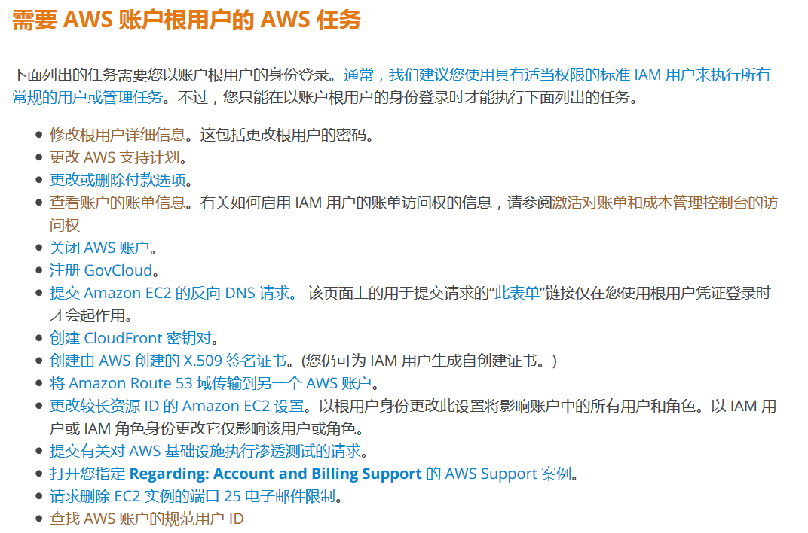

# [王孝东的个人空间](https://scm-git.github.io/)
## AWS

### AWS IAM
* [深入理解IAM和访问控制](http://www.infoq.com/cn/articles/aws-iam-dive-in)
* [AWS使用tag进行某些资源隔离](http://cloudrender.blog.51cto.com/2091666/1946573)

### AWS 命令行配置
  以下三种方式选一即可:
1. 命令行选项  
  ```
  $ aws configure
  AWS Access Key ID [None]: Your AWS Access Key ID
  AWS Secret Access Key [None]: Your AWS Access Secret Key
  Default region name [None]: us-west-2
  Default output format [None]: json
  ```
2. 环境变量  
  ```
  $ export AWS_ACCESS_KEY_ID=Your AWS Access Key ID
  $ export AWS_SECRET_ACCESS_KEY=Your AWS Access Secret Key
  $ export AWS_DEFAULT_REGION=us-west-2
  ```
3. 使用credentials文件:
  ```
  [default]
  aws_access_key_id=Your AWS Access Key ID
  aws_secret_access_key=Your AWS Access Secret Key
  ```

### AWS 编程
[获取AWS的Client的工具类示例代码](aws-java-credential.md),该示例代码支持读取机器本地的credential文件以及AWS_ACCESS_KEY_ID两种方式进行认证。

### EC2
* 列出us-west-1中的所有EC2的名称和公有IP：
  ```
  aws ec2 describe-instances --query 'Reservations[*].Instances[*].[Tags[?Key==`Name`].Value,PublicIpAddress]' --region us-west-1 --output text
  ```
* 列出us-west-1中的所有EC2的名称、公有IP、私有IP以及Access Key：
  ```
  $ aws ec2 describe-instances --query 'Reservations[*].Instances[*].[Tags[?Key==`Name`].Value,PublicIpAddress,PrivateIpAddress,KeyName]' --region us-west-1 --output table
  ```
  
### 使用aws cli命令行工具批量添加/删除安全组inbound列表
* 使用的命令: `aws ec2 describe-security-groups`, `authorize-security-group-ingress`, `revoke-security-group-ingress`
* 示例脚本

  ```shell
  #!/bin/bash
  
  case $1 in
  	"ap-southeast-1")
  		REGION="ap-southeast-1"
  		;;
  	*)
  		REGION="us-west-1"
  		;;
  esac
  
  echo "region:$REGION"
  
  SGLIST=$(aws ec2 describe-security-groups --query 'SecurityGroups[*].{ID:GroupId}' --region $REGION --output text)
  MYIP=$(curl -XGET "http://checkip.amazonaws.com")
  MYCIDR=${MYIP}/32
  echo "my CIDR: $MYCIDR"
  
  for SG in $SGLIST
  do
  	echo "add ssh for $SG,$MYCIDR,$REGION"
  	aws ec2 authorize-security-group-ingress --group-id $SG --protocol tcp --port 22 --cidr $MYCIDR --region $REGION
  # 	aws ec2 revoke-security-group-ingress --group-id $SG --protocol tcp --port 22 --cidr $MYCIDR --region $REGION
  done
  ```
  
### 使用ec2.py获取EC2列表
* 1.下载ec2.py文件和ec2.ini文件，下载后将其放入同一个目录中
* 2.配置aws，可以使用上面配置中的第一种方式
* 3.安装python-pip
  
  ```
  wxd@wangxiaodong:~/main/hpbridge$ sudo apt install python-pip
  ```
  
* 4.安装boto

  ```
  wxd@wangxiaodong:~/main/hpbridge$ pip install boto
  ```
  
* 5.执行命令获取EC2列表，该命令可能需要等较长的时间才会返回，因为输出的内容较多
  
  ```
  wxd@wangxiaodong:/etc/ansible$ ./ec2.py --help
  usage: ec2.py [-h] [--list] [--host HOST] [--refresh-cache]
                [--profile BOTO_PROFILE]
  
  Produce an Ansible Inventory file based on EC2
  
  optional arguments:
    -h, --help            show this help message and exit
    --list                List instances (default: True)
    --host HOST           Get all the variables about a specific instance
    --refresh-cache       Force refresh of cache by making API requests to EC2
                          (default: False - use cache files)
    --profile BOTO_PROFILE, --boto-profile BOTO_PROFILE
                          Use boto profile for connections to EC2
  wxd@wangxiaodong:/etc/ansible$ ./ec2.py --list
  ```
  
* 6.可以编辑ec2.ini文件来过滤EC2，例如：

  ```
  # Retrieve only instances with (key=value) env=staging tag
  # instance_filters = tag:env=staging
  
  # Retrieve only instances with role=webservers OR role=dbservers tag
  # instance_filters = tag:role=webservers,tag:role=dbservers
  
  # Retrieve only t1.micro instances OR instances with tag env=staging
  # instance_filters = instance-type=t1.micro,tag:env=staging
  
  #instance_filters = key-name=dev-test-cfn
  #instance_filters = key-name=cloud-pie
  instance_filters = key-name=access-sgp
  ```

* 7.编辑ec2.ini文件，过滤没有使用的region，否则ec2.py执行的时候会check所有的region，会导致执行时间特别长：

  ```
  #regions = all 
  regions = us-west-1,ap-southeast-1
  
  #rds = False
  #elasticache = False
  cache_max_age = 60
  ```
  以上修改将regions指定到us-west-1和ap-southeast-1两个region；注释掉rds和elasticache，表示不check这两种实例；另外将缓存时间设置为1分钟

* 8.通过命令行添加ssh入站允许：
  
  ```
  aws ec2 describe-security-groups
  aws ec2 authorize-security-group-ingress --group-id sg-5da90d3b --protocol tcp --port 22 --cidr 106.87.20.57/32
  aws ec2 authorize-security-group-ingress --group-name wxd-sg-tky-1 --protocol all --port all --cidr 27.11.103.80/32 --region ap-northeast-1
  ```
  首先查看要修改的安全组ID，然后复制到`authorize-security-group-ingress`中
  
### VPC AZ Subnet CIDR
* CIDR：前缀IP必须是子网的最小IP，否则就是一个无效CIDR  
  有效： 10.0.0.0/24，无效：10.0.0.11/24
  有效： 10.0.0.192/26，无效：10.0.0.196/26
  计算的最小IP：2<sup>(8-x)</sup> * n；n为第n个子网，x是CIDR中落在网络段中的模
* 10.0.1.0/23 包括 10.0.0.0/24
  10.0.1.0/23
  00001100.00000000.00000001.00000000 起始IP：10.0.1.0
  11111111.11111111.11111110.00000000 子网掩码255.255.254.0
  10.0.3.0/23 
  10.0.1.193/26
  Must be a valid CIDR block. Did you mean 10.0.1.192/26?
* 同一个AZ中的主机间的ping速率为0.4ms; 不同AZ中的主机间的ping速率为1.2ms
* EC2之间无法ping通的原因通常是安全组中没有设置ICMP的入栈规则，因为ping命令使用的是ICMP协议
* [VPC相关笔记](./aws-vpc.md)

### AWS 一般参考
* [AWS 区域和终端节点](http://docs.aws.amazon.com/zh_cn/general/latest/gr/rande.html)
* [AWS 安全凭证](http://docs.aws.amazon.com/zh_cn/general/latest/gr/aws-security-credentials.html)
* [Amazon 资源名称 (ARN) 和 AWS 服务命名空间](http://docs.aws.amazon.com/zh_cn/general/latest/gr/aws-arns-and-namespaces.html)
* [签署 AWS API 请求](http://docs.aws.amazon.com/zh_cn/general/latest/gr/signing_aws_api_requests.html)
* [AWS 服务限制](http://docs.aws.amazon.com/zh_cn/general/latest/gr/aws_service_limits.html)
* [需要 AWS 账户根用户的 AWS 任务](http://docs.aws.amazon.com/zh_cn/general/latest/gr/aws_tasks-that-require-root.html)
* [AWS 的 IP 地址范围](http://docs.aws.amazon.com/zh_cn/general/latest/gr/aws-ip-ranges.html)
* [AWS 中的错误重试和指数退避](http://docs.aws.amazon.com/zh_cn/general/latest/gr/api-retries.html)
* [AWS 命令行工具](http://docs.aws.amazon.com/zh_cn/general/latest/gr/GetTheTools.html)
* [AWS 词汇表](http://docs.aws.amazon.com/zh_cn/general/latest/gr/glos-chap.html)

### AWS 安全凭证
* [需要AWS账户根用户的AWS任务](http://docs.aws.amazon.com/zh_cn/general/latest/gr/aws_tasks-that-require-root.html)
  

  

