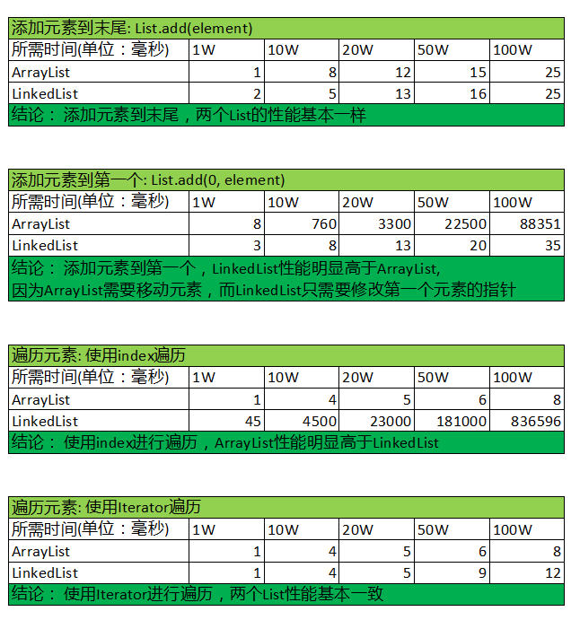

# [王孝东的个人空间](https://scm-git.github.io/)
## ArrayList & LinkedList比较以及源码

面试的时候经常被问ArrayList与LinkedList的区别，本文通过代码实践来证明他们的区别，并通过源码来分析造成这些区别的原因：
首先贴一下测试代码: ListTest.java
```java
import java.util.*;

import static java.lang.System.out;

/**
 * Created by wanxiaod on 10/9/2017.
 */
public class ListTest {

    private final static int LIST_SIZE = 1000000;

    /**
     * 测试ArrayList和LinkedList add方法性能
     */
    public static List testListAdd(List list, boolean addFirst){
        //List arrayList = new ArrayList();

        long startTime = System.currentTimeMillis();
        for(int i=0; i < LIST_SIZE; i++){
            if(addFirst) {
                list.add(0,i);
            } else {
                list.add(i);
            }
        }
        long endTime = System.currentTimeMillis();
        out.println("List add " + LIST_SIZE + " int element time:" + (endTime - startTime));
        return list;
    }

    /**
     * 测试通过index来遍历list的性能
     * @param list
     */
    public static void testListGetByIndex(List list){
        long startTime = System.currentTimeMillis();
        for(int i=0; i<LIST_SIZE; i++) {
            list.get(i);
        }

        long endTime = System.currentTimeMillis();
        out.println("List get element by index time:" + (endTime - startTime));
    }

    /**
     * 测试通过iterator来遍历list的性能
     * @param list
     */
    public static void testListGetByIterator(List list){
        long startTime = System.currentTimeMillis();

        Iterator iterator = list.iterator();
        while (iterator.hasNext()){
            iterator.next();
        }

        long endTime = System.currentTimeMillis();
        out.println("List get element by iterator time:" + (endTime - startTime));
    }

    /**
     * 测试List get某一个元素的性能
     * @param index
     */
    public static void getListElement(List list, int index){
        long start = System.currentTimeMillis();
        list.get(index);
        out.println("get element time:" + (System.currentTimeMillis() - start) );
    }

    public static void main(String[] args){
        out.print("ArrayList add -- ");
        List arrayList = ListTest.testListAdd(new ArrayList(), false);
        out.print("ArrayList get -- ");
        ListTest.testListGetByIndex(arrayList);
        ListTest.testListGetByIterator(arrayList);

        out.print("LinkedList add -- ");
        List linkedList = ListTest.testListAdd(new LinkedList(), false);
        out.print("LinkedList get -- ");
        ListTest.testListGetByIndex(linkedList);
        ListTest.testListGetByIterator(linkedList);

        getListElement(arrayList, 500000);
        getListElement(linkedList, 500000);
    }
}

```
使用以上代码测试ArrayList和LinkedList的性能，分别测试了元素个数为1W, 10W, 20W, 50W和100W的情况。
测试环境为：
* 惠普ZBook 15 G2笔记本：4核8线程CPU(2.80 Ghz)， 16G内存
* JDK_1.8.0_66

得到的结果如下图：



从上图中可以得出以下结论：
* 从第一个表可以看出：对于List.add(e) -- 添加元素到末尾；不管多少元素，性能都是一样的。
* 从第二个表可以看出：对于List.add(index,e)方法 -- 添加元素到某个特定位置(本次测试的每次添加到第一个元素，即：list.add(0, e))时，LinkedList的性能明显高于ArrayList，并且LinkedList的性能跟插入元素到末尾一样。
* 从第三个表可以看出：当使用index来遍历list时，ArrayList的性能高于LinkedList
* **从最后一个表中可以看出：不管List中元素多少，使用Iterator的方式来遍历List，两个list的性能是一样的，且都非常好，所以使用Iterator的方式遍历总是没错的。**

有以上结论之后，再来看一下核心源码：这里只贴出add(index,e)和get(index)相关源码，因为主要分析添加元素和使用index遍历时性能差异的原因：

ArrayList.java
```java
public class ArrayList<E> extends AbstractList<E>
        implements List<E>, RandomAccess, Cloneable, java.io.Serializable
{
    private static final int DEFAULT_CAPACITY = 10;

    private static final Object[] EMPTY_ELEMENTDATA = {};

    private static final Object[] DEFAULTCAPACITY_EMPTY_ELEMENTDATA = {};

    // ArrayList存储元素的数组：从此处可以看出，ArrayList其实是一个数组
    transient Object[] elementData; // non-private to simplify nested class access

    //list的size大小，每次添加需要将该值+1;
    private int size;
    
    // 添加元素到数组末尾
    public boolean add(E e) {
        ensureCapacityInternal(size + 1);  // Increments modCount!!
        elementData[size++] = e;
        return true;
    }
    
    // 添加元素到指定位置
    public void add(int index, E element) {
        rangeCheckForAdd(index);

        ensureCapacityInternal(size + 1);  // Increments modCount!!
        
        // 该步骤是导致性能底下的原因
        System.arraycopy(elementData, index, elementData, index + 1,
                         size - index);
        elementData[index] = element;
        size++;
    }
}
```
从以上ArrayList的代码可以看出，如果添加元素到末尾，只需要两步，1：扩容数组，2：将添加元素赋值给数组的末尾元素；对于添加元素到指定位置则需要多加一步：**将指定位置后面的元素复制到指定位置的下一个位置。这也是导致添加到指定位置性能底下的原因**

LinkedList.java
```java
public class LinkedList<E>
    extends AbstractSequentialList<E>
    implements List<E>, Deque<E>, Cloneable, java.io.Serializable
{
    // List的size大小，每次增减元素都需要相应的增减该值
    transient int size = 0;
    
    // 第一个元素
    transient Node<E> first;

    // 最后一个元素
    transient Node<E> last;
    
    // 添加元素到末尾
    public boolean add(E e) {
        linkLast(e);    //将元素链接到链表的末尾
        return true;
    }
    
    // 添加元素到指定位置
    public void add(int index, E element) {
        checkPositionIndex(index);

        if (index == size)
            linkLast(element);
        else
            linkBefore(element, node(index));
    }
    
    // 链接元素到末尾
    void linkLast(E e) {
        final Node<E> l = last;
        final Node<E> newNode = new Node<>(l, e, null);
        last = newNode;
        if (l == null)
            first = newNode;
        else
            l.next = newNode;
        size++;
        modCount++;
    }

    // 链接元素到某个元素之后
    void linkBefore(E e, Node<E> succ) {
        // assert succ != null;
        final Node<E> pred = succ.prev;
        final Node<E> newNode = new Node<>(pred, e, succ);
        succ.prev = newNode;
        if (pred == null)
            first = newNode;
        else
            pred.next = newNode;
        size++;
        modCount++;
    }
    
    // 根据index返回对应的Node
    Node<E> node(int index) {
        // assert isElementIndex(index);

        if (index < (size >> 1)) {
            Node<E> x = first;
            for (int i = 0; i < index; i++)
                x = x.next;
            return x;
        } else {
            Node<E> x = last;
            for (int i = size - 1; i > index; i--)
                x = x.prev;
            return x;
        }
    }
    
    // 通过index获取元素
    public E get(int index) {
        checkElementIndex(index);
        return node(index).item;
    }
    
    private static class Node<E> {
        E item;
        Node<E> next;
        Node<E> prev;

        Node(Node<E> prev, E element, Node<E> next) {
            this.item = element;
            this.next = next;
            this.prev = prev;
        }
    }
}
```
从LinkedList的代码可以看出：
1. 所有添加的元素都会包装成Node，Node是LinkedList的一个私有静态内部类，Node中有三个属性，previous：指向前一个元素，next：指向下一个元素，item：元素本身
2. LinkedList对象只用于first和last属性，即所有读取操作都只能从first或者last节点开始
3. 对于LinkedList.add(e)方法，直接将元素包装成Node并链接到链表的最后一个元素：`final Node<E> newNode = new Node<>(l, e, null);`
   * 将当前元素的previous指向之前的last节点，
   * 将当前元素的last的指向null
   * `l.next = newNode;`将之前的last元素的next指向当前元素
4. 对于`LinkedList.add(index, e)`方法：如果index不等于size，使用`linkBefore(e, succ)`方法；该方法多一个查找index节点的操作，找到节点之后，修改相应的previous以及next即可；不需要移动元素位置
5. 对于`E get(index)`操作，之前说到LinkedList的get操作性能较ArrayList低，从源码中可以看到，他使用`Node node(index)`查找这个节点，node(index)会首先判断index是落在size的前半段还是后半段，如果是前半段，则从first节点开始查找，如果是后半段则从last节点开始查找；从这个地方也可以看出，通过get(index)时，需要遍历多次才能找到相应的节点，尤其是如果该index靠近list的中间部分时，遍历次数最多(因为只能从开始节点或者末尾节点开始遍历)：这里有一个测试数据可以参考一下：当LinkedList中有一个1000W个元素时，get第500W个元素需要50毫秒左右，而get首尾的元素可以为0-1毫秒
