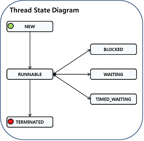

# [王孝东的个人空间](https://scm-git.github.io/)
## Java 并发

### Thread
#### Thread状态：
* New(新创建)：新创建一个线程，还没有调用start方法，状态为new
* Runnable：调用了start方法，线程的状态变为Runnable，此时线程可以是准备执行，也可以是正在执行，这依赖于操作系统提供运行的时间；并且线程开始后，它不必始终保持运行，它可能被中断。
* Blocked(被阻塞)：当一个线程试图获取一个内部的对象锁(不是java.util.concurrent库中的锁)，而该对象锁被其他线程持有，则该线程进入阻塞状态。当所有其他线程释放该锁，并且线程调度器允许本线程持有该锁时，该线程变为非阻塞状态。
* Waiting(等待)：当线程等待另一个线程通知调度器一个条件时，他自己进入等待状态。在调用Object.wait方法或者Thread.join方法，或者等待java.util.concurrent中的Lock或Condition时，线程会处于Waiting状态。**被阻塞状态和等待状态状态是不同的**
* Timed Waiting(计时等待):与Waiting状态类似，只是该状态有一个超时设置，当超时期满或者接收到其他适当的通知后，线程可以变为Runnable状态。带超时的方法有：Thread.sleep, Object.wait, Thread.join, Lock.tryLock和Condition.await。
* Terminated(被终止)：1. run方法执行完毕正常退出； 2. 出现没有捕获的异常而意外终止
  
  
#### Thread属性
* 线程优先级：在Java程序设计语言中，每一个线程有一个由下级。默认情况下，一个线程集成他父类的优先级。可以用setPriority方法来修改优先级。可以将优先级设置为MIN_PRIORITY(1)和MAX_PRIORITY(10)之间的任何值。NORMAL_PRIORITY被定义为5。**线程的优先级高度依赖于操作系统。** Java的线程优先级会被映射到数宿主机平台的优先级上，优先级个数可能更多，也可能更少。
* 守护线程：`t.setDaemon(true)`，将线程设置为守护线程，在start之前调用。
* 未捕获异常处理器：

#### 同步
* 使用java.util.concurrent包中的Lock以及Condition
* 使用[synchronized](./synchronized.md)
  

  

