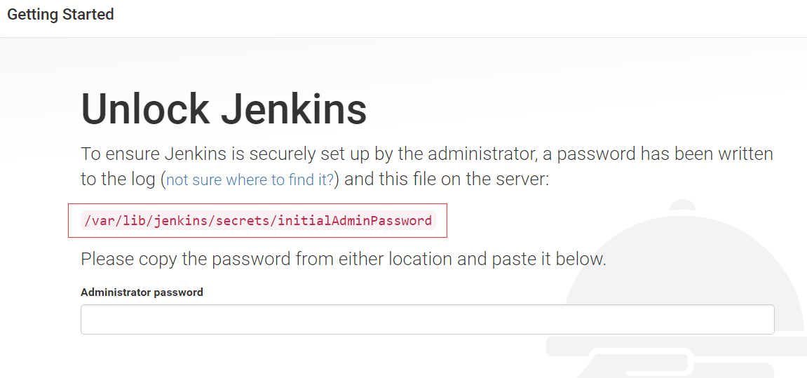
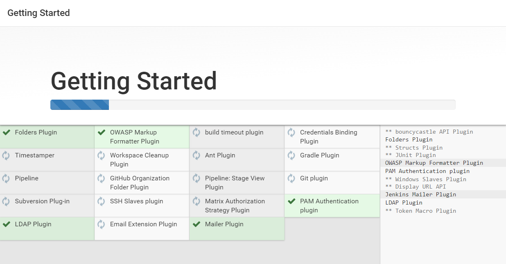
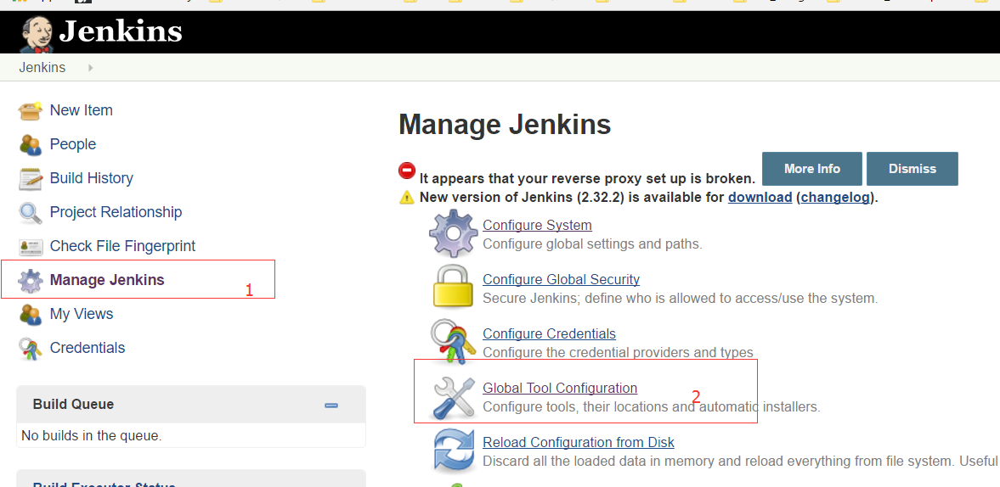
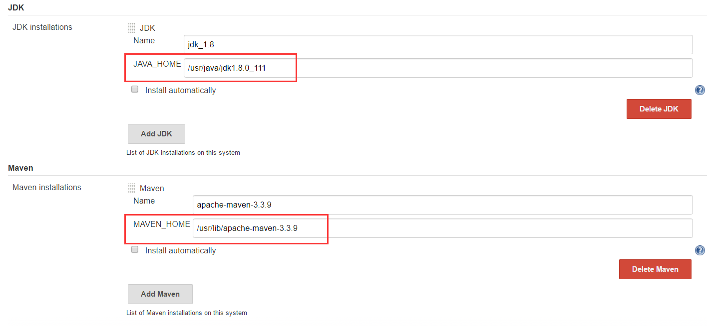
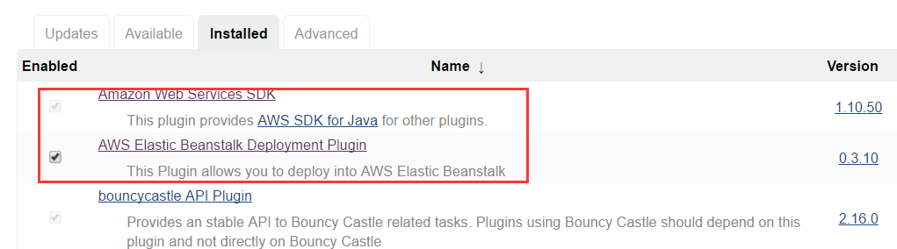
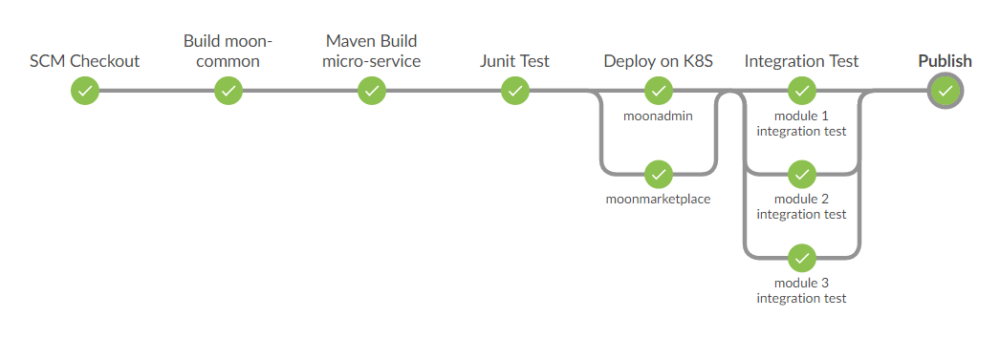

# [王孝东的个人空间](https://scm-git.github.io/)
## [Jenkins](https://jenkins.io)
### 1. 安装
官网安装说明：
* [Ubuntu/Debian](https://pkg.jenkins.io/debian-stable/)
* [Red Hat/CentOS/Fedora](https://pkg.jenkins.io/redhat-stable/)
安装步骤:
1. 查看系统版本：`cat /etc/*-release`
  ```
  $ cat /etc/*-release
  CentOS Linux release 7.1.1503 (Core)
  NAME="CentOS Linux"
  VERSION="7 (Core)"
  ID="centos"
  ID_LIKE="rhel fedora"
  VERSION_ID="7"
  PRETTY_NAME="CentOS Linux 7 (Core)"
  ANSI_COLOR="0;31"
  CPE_NAME="cpe:/o:centos:centos:7"
  HOME_URL="https://www.centos.org/"
  BUG_REPORT_URL="https://bugs.centos.org/"

  CENTOS_MANTISBT_PROJECT="CentOS-7"
  CENTOS_MANTISBT_PROJECT_VERSION="7"
  REDHAT_SUPPORT_PRODUCT="centos"
  REDHAT_SUPPORT_PRODUCT_VERSION="7"

  CentOS Linux release 7.1.1503 (Core)
  CentOS Linux release 7.1.1503 (Core)
  ```
2. 系统版本为CentOS，则安装CentOS的方式安装，依次执行以下命令：
```
$ sudo wget -O /etc/yum.repos.d/jenkins.repo http://pkg.jenkins-ci.org/redhat-stable/jenkins.repo
$ sudo rpm --import https://jenkins-ci.org/redhat/jenkins-ci.org.key
$ sudo yum install jenkins
```
3. 启动/停止/重启
```
$ sudo service jenkins start/stop/restart
```

### 2. 配置Jenkins
1. 在浏览器中访问Jenkins: http://ip:8080  
ip: 主机IP
8080：默认端口是8080， 如果启动的时候出现错误，可能是8080端口被占用，可以设置其他端口号；  
第一次登录的时候需要输入初始密码：按照页面中的提示，直接获取即可  

2. 输入后即可进入主页面，首先会让你选择安装插件：如果不熟悉相关插件，则直接选择推荐的插件，如果后续需要其他插件，可以再继续安装，安装过程：  

**Note: 如果jenkins是配置在公司内网，可能需要配置网络代理**
3. 插件安装完成后，jenkins会自动跳转到主页面，然后配置全局tools: Manage Jenkins -> Global Tool Configuration  

主要配置JDK和Maven，如果需要其他工具，配置方式也是相似的：  

Name可以自己任意命名，JAVA_HOME和MAVEN_HOME则根据自己主机的路径配置，例如我们的路径分别为：/usr/java/jdk1.8.0_111 和 /usr/lib/apache-maven-3.3.9  
4. 插件管理：Manage Jenkins -> Manage Plugins  
   Jenkins提供了太多的插件，具体需要用到哪些插件需要根据项目的情况而定，通常情况下，安装了Jenkins推荐的插件就基本够用了。最近我们的项目使用了AWS的Beanstalk服务，所以自己手动添加Beanstalk相关插件：
   
### 3. Jenkins Pipeline
目前Jenkins更推荐使用pipeline来配置Jenkins任务，主要有如下好处：
* Jenkins Pipeline使用代码描述Jenkins任务，通常可以将其写入Jenkinsfile并且保存到版本库中，可以很容易的跟踪Pipeline任务的修改情况；一个Jenkinsfile就是一个Jenkins任务，放入版本库也变相的备份了Jenkins任务
* 创建Jenkins任务更加容易，只需要从版本库中拉取一个Jenkinsfile即可完成
* Jenkins官方提供了Blue Ocean插件，便于查看Pipeline中每个Stage的执行情况  
Jenkins Pipeline代码示例：  
```
//=====================Requirement for this pipeline script=============================
// 1. Install docker on Jenkins master or node
// 2. Configure the docker private registry
//      Docker private registry is running
// 3. Install Maven and configure Maven Settings.xml: configure the nexus repo and private docker registry
//      Nexus is running
// 4. Configure the /etc/hosts on Jenkins master or node: Nexus repo host and Docker registry host
// 5. Install git
// 6. Configure Jenkins node: k8s master
// 7. prepare k8s replication controller file: moonadmin, moonmarketplace ...
// 8. create k8s base service first: discovery service, configure service, edge service, (auth)
// 9. Jenkins credentials: github credential


node('master'){
    stage('SCM Checkout'){
        echo 'Checkout...'
        sh 'rm -rf *'
        //git credentialsId: 'wxd_github_houston_token', url: 'https://github.houston.entsvcs.net/mooncloud/clone-moon-common.git'
        //git credentialsId: 'wxd_github_houston_token', url: 'https://github.houston.entsvcs.net/mooncloud/clone-moon-admin.git'
        checkout([$class: 'GitSCM', branches: [[name: '*/master']], doGenerateSubmoduleConfigurations: false, extensions: [[$class: 'RelativeTargetDirectory', relativeTargetDir: 'clone-moon-common']], submoduleCfg: [], userRemoteConfigs: [[credentialsId: 'wxd_github_houston_token', url: 'https://github.houston.entsvcs.net/mooncloud/clone-moon-common.git']]])
        checkout([$class: 'GitSCM', branches: [[name: '*/master']], doGenerateSubmoduleConfigurations: false, extensions: [[$class: 'RelativeTargetDirectory', relativeTargetDir: 'clone-moon-admin']], submoduleCfg: [], userRemoteConfigs: [[credentialsId: 'wxd_github_houston_token', url: 'https://github.houston.entsvcs.net/mooncloud/clone-moon-admin.git']]])
        //checkout([$class: 'GitSCM', branches: [[name: '*/master']], doGenerateSubmoduleConfigurations: false, extensions: [[$class: 'RelativeTargetDirectory', relativeTargetDir: 'clone-moon-supportmgmt']], submoduleCfg: [], userRemoteConfigs: [[credentialsId: 'wxd_github_houston_token', url: 'https://github.houston.entsvcs.net/mooncloud/clone-moon-supportmgmt.git']]])
        //checkout([$class: 'GitSCM', branches: [[name: '*/master']], doGenerateSubmoduleConfigurations: false, extensions: [[$class: 'RelativeTargetDirectory', relativeTargetDir: 'clone-moon-paasmgmt']], submoduleCfg: [], userRemoteConfigs: [[credentialsId: 'wxd_github_houston_token', url: 'https://github.houston.entsvcs.net/mooncloud/clone-moon-paasmgmt.git']]])
        checkout([$class: 'GitSCM', branches: [[name: '*/master']], doGenerateSubmoduleConfigurations: false, extensions: [[$class: 'RelativeTargetDirectory', relativeTargetDir: 'clone-moon-marketplace']], submoduleCfg: [], userRemoteConfigs: [[credentialsId: 'wxd_github_houston_token', url: 'https://github.houston.entsvcs.net/mooncloud/clone-moon-marketplace.git']]])
        //checkout([$class: 'GitSCM', branches: [[name: '*/master']], doGenerateSubmoduleConfigurations: false, extensions: [[$class: 'RelativeTargetDirectory', relativeTargetDir: 'clone-moon-clustermgmt']], submoduleCfg: [], userRemoteConfigs: [[credentialsId: 'wxd_github_houston_token', url: 'https://github.houston.entsvcs.net/mooncloud/clone-moon-clustermgmt.git']]])
        //checkout([$class: 'GitSCM', branches: [[name: '*/master']], doGenerateSubmoduleConfigurations: false, extensions: [[$class: 'RelativeTargetDirectory', relativeTargetDir: 'clone-moon-applicationmgmt']], submoduleCfg: [], userRemoteConfigs: [[credentialsId: 'wxd_github_houston_token', url: 'https://github.houston.entsvcs.net/mooncloud/clone-moon-applicationmgmt.git']]])

    }

    stage('Build moon-common'){
        def mvnHome = 'Apache-Maven'
        def javaHome= 'JDK8'
        def M2_HOME='/usr/lib/apache-maven/apache-maven-3.3.9'
        //def pom = readMavenPom file: 'pom.xml'
        //def pom = readMavenPom file: 'pom.xml'
        // ,'DOCKER_HOST=tcp://127.0.0.1:4243']
        withEnv(["PATH+MAVEN=${tool mvnHome}/bin:${tool javaHome}/bin",'DOCKER_HOST=tcp://127.0.0.1:4243']){
            echo 'Build...'
            sh 'pwd'
            sh 'mvn clean deploy -f clone-moon-common/pom.xml -s /usr/lib/apache-maven/apache-maven-3.3.9/conf/settings.xml'
        }
        sleep 5
    }

    stage('Maven Build micro-service'){
        def mvnHome = 'Apache-Maven'
        def javaHome= 'JDK8'
        def M2_HOME='/usr/lib/apache-maven/apache-maven-3.3.9'
        //def pom = readMavenPom file: 'pom.xml'
        //def pom = readMavenPom file: 'pom.xml'
        // ,'DOCKER_HOST=tcp://127.0.0.1:4243']
        withEnv(["PATH+MAVEN=${tool mvnHome}/bin:${tool javaHome}/bin",'DOCKER_HOST=tcp://127.0.0.1:4243']){
            echo 'Build Micro Service Module Start...'

            echo 'clone-moon-admin start...'
            sh 'mvn clean install -f clone-moon-admin/pom.xml -s /usr/lib/apache-maven/apache-maven-3.3.9/conf/settings.xml'

            //echo 'clone-moon-supportmgmt start...'
            //sh 'mvn clean install -f clone-moon-supportmgmt/pom.xml -s /usr/lib/apache-maven/apache-maven-3.3.9/conf/settings.xml'

            //echo 'clone-moon-paasmgmt start...'
            //sh 'mvn clean install -f clone-moon-paasmgmt/pom.xml -s /usr/lib/apache-maven/apache-maven-3.3.9/conf/settings.xml'

            echo 'clone-moon-marketplace start...'
            sh 'mvn clean install -f clone-moon-marketplace/pom.xml -s /usr/lib/apache-maven/apache-maven-3.3.9/conf/settings.xml'

            //echo 'clone-moon-clustermgmt start...'
            //sh 'mvn clean install -f clone-moon-clustermgmt/pom.xml -s /usr/lib/apache-maven/apache-maven-3.3.9/conf/settings.xml'

            //echo 'clone-moon-applicationmgmt start...'
            //sh 'mvn clean install -f clone-moon-applicationmgmt/pom.xml -s /usr/lib/apache-maven/apache-maven-3.3.9/conf/settings.xml'

        }
        sleep 5
    }

    stage('Junit Test'){
        echo 'Junit Test...'
        sleep 5
    }

    stage('Deploy on K8S'){
        parallel("moonadmin":{
            node('k8smaster-test'){
                sh 'kubectl delete -f /root/kubrepo/devops/api/devopsmoonadmin.yaml'
                sleep 20
                sh 'kubectl create -f /root/kubrepo/devops/api/devopsmoonadmin.yaml'
            }
        },"moonmarketplace":{
            node('k8smaster-test'){
                sh 'kubectl delete -f /root/kubrepo/devops/api/devopsmoonmarketplace.yaml'
                sleep 20
                sh 'kubectl create -f /root/kubrepo/devops/api/devopsmoonmarketplace.yaml'
            }
        })

        echo 'Deploy done...'
        sleep 5
    }

    stage('Integration Test'){
        echo 'Integration Test start...'
        //build job: 'DevOpsTest', parameters: [string(name: 'BaseURL', value: '')]
        //sh 'ls ../DevOpsTest/test_result'
        //junit allowEmptyResults: true, testResults: '../DevOpsTest/test_result/*.html'
        //input('Publish?')

        parallel("module 1 integration test":{
            echo 'Module-1 test start...'
            sleep 5
            echo 'Module-1 test end...'
        }, "module 2 integration test":{
            echo 'Module-2 test start...'
            sleep 10
            echo 'Module-2 test end...'
        }, "module 3 integration test":{
            echo 'Module-3 test start...'
            sleep 5
            echo 'Module-3 test end...'
        })

        echo 'Integration Test end...'
    }

    stage('Publish'){
        echo 'Publish...'
    }
}
```
Blue Ocean展示的各Stage执行情况：

### 4. Jenkins 常见错误
* 打开Robot Framework报告错误：类似以下错误
```
...
Opening Robot Framework log failed
Verify that you have JavaScript enabled in your browser.
Make sure you are using a modern enough browser. Firefox 3.5, IE 8, or equivalent is required, newer browsers are recommended.

Check are there messages in your browser's JavaScript error log. Please report the problem if you suspect you have encountered a bug.
...
```
**处理：**
如果是service jenkins start，这样的启动方式，可以修改启动脚本：/etc/sysconfig/jenkins文件中JAVA启动参数，添加如下粗体部分：    
JENKINS_JAVA_OPTIONS="**-Dhudson.model.DirectoryBrowserSupport.CSP=** -Djava.awt.headless=true"  
如果是java -jar启动，可以直接在后面加高亮部分参数； 如果是tomcat，可以修改Tomcat的参数，或者解压的包中可能有jenkins.xml文件，修改其中的`<arguments></arguments>`部分  