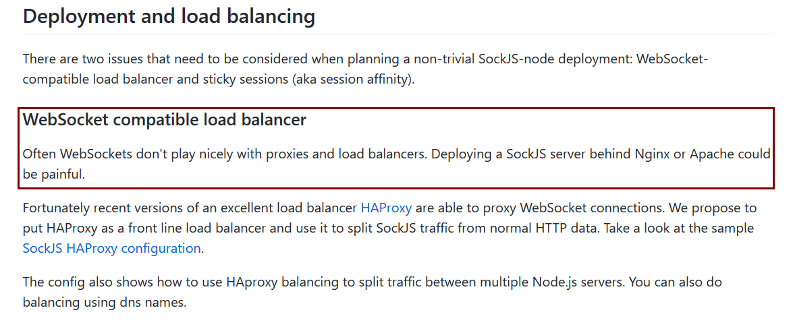

# [王孝东的个人空间](https://scm-git.github.io/)
## HAProxy [官网](http://www.haproxy.org/)
### Install HAProxy on Ubuntu
```
$ sudo apt install haproxy
```

### HAProxy [文档](http://cbonte.github.io/haproxy-dconv/1.7/intro.html)

### HAProxy配置HTTP负载均衡以及日志配置
HAProxy使用Linux的rsyslog服务来记录日志，因此需要配置haproxy和rsyslog
1. 安装好haproxy后，修改`/etc/haproxy/haproxy.cfg`文件，内如容下：
  
  ```
  global
          #log /dev/log   local0
          #log /dev/log   local1 notice
          #chroot /var/lib/haproxy
          log 127.0.0.1 local3
  
          stats socket /run/haproxy/admin.sock mode 660 level admin
          stats timeout 30s
          user haproxy
          group haproxy
          daemon
  
          # Default SSL material locations
          ca-base /etc/ssl/certs
          crt-base /etc/ssl/private
  
          # Default ciphers to use on SSL-enabled listening sockets.
          # For more information, see ciphers(1SSL). This list is from:
          #  https://hynek.me/articles/hardening-your-web-servers-ssl-ciphers/
          # An alternative list with additional directives can be obtained from
          #  https://mozilla.github.io/server-side-tls/ssl-config-generator/?server=haproxy
          ssl-default-bind-ciphers ECDH+AESGCM:DH+AESGCM:ECDH+AES256:DH+AES256:ECDH+AES128:DH+AES:RSA+AESGCM:RSA+AES:!aNULL:!MD5:!DSS
          ssl-default-bind-options no-sslv3
  
  defaults
          mode http
          log global
          option httplog
          option  http-server-close
          option  dontlognull
          option  redispatch
          option  contstats
          retries 3
          backlog 10000
          timeout client          25s
          timeout connect          5s
          timeout server          25s
          # timeout tunnel available in ALOHA 5.5 or HAProxy 1.5-dev10 and higher
          timeout tunnel        3600s
          timeout http-keep-alive  1s
          timeout http-request    15s
          timeout queue           30s
          timeout tarpit          60s
          default-server inter 3s rise 2 fall 3
          option forwardfor
  
          errorfile 400 /etc/haproxy/errors/400.http
          errorfile 403 /etc/haproxy/errors/403.http
          errorfile 408 /etc/haproxy/errors/408.http
          errorfile 500 /etc/haproxy/errors/500.http
          errorfile 502 /etc/haproxy/errors/502.http
          errorfile 503 /etc/haproxy/errors/503.http
          errorfile 504 /etc/haproxy/errors/504.http
  
  frontend ft_web
          option httplog
          log /dev/log local3 info
          bind *:7000 name http
          maxconn 10000
          default_backend bk_web
   
  backend bk_web                      
          balance hdr(tableId)
          server websrv1 localhost:7070 maxconn 10000 weight 10 cookie websrv1 check
          server websrv2 localhost:7071 maxconn 10000 weight 10 cookie websrv2 check
  ```
  
2. 配置如果安装了haproxy，通常`/etc/rsyslog.d/`目录下会有一个*-haproxy.cfg的文件，修改这个文件：
  
  ```
  # Create an additional socket in haproxy's chroot in order to allow logging via
  # /dev/log to chroot'ed HAProxy processes
  $AddUnixListenSocket /var/lib/haproxy/dev/log
  
  local3.*	/var/log/haproxy/haproxy.log
  
  # Send HAProxy messages to a dedicated logfile
  if $programname startswith 'haproxy' then /var/log/haproxy/haproxy.log
  &~
  ```
  
3. 重启haproxy和rsyslog

  ```
  $ sudo service haproxy restart
  $ sudo service rsyslog restart
  ```

### 配置HAProxy作为WebSocket的负载均衡器
HAProxy配置WebSocket负载均衡，
**WebSocket无法设置请求header，因此如果想通过header的某个参数来来做路由是不可行的；但是可以将参数放入url中，通过url_param来获取该参数，从而可以路由到某一固定的后端服务器**

  ```
  global
  	#log /dev/log	local0
  	#log /dev/log	local1 notice
  	#chroot /var/lib/haproxy
  	log 127.0.0.1 local3 info
  
  	stats socket /run/haproxy/admin.sock mode 660 level admin
  	stats timeout 30s
  	user haproxy
  	group haproxy
  	daemon
  
  	# Default SSL material locations
  	ca-base /etc/ssl/certs
  	crt-base /etc/ssl/private
  
  	# Default ciphers to use on SSL-enabled listening sockets.
  	# For more information, see ciphers(1SSL). This list is from:
  	#  https://hynek.me/articles/hardening-your-web-servers-ssl-ciphers/
  	# An alternative list with additional directives can be obtained from
  	#  https://mozilla.github.io/server-side-tls/ssl-config-generator/?server=haproxy
  	ssl-default-bind-ciphers ECDH+AESGCM:DH+AESGCM:ECDH+AES256:DH+AES256:ECDH+AES128:DH+AES:RSA+AESGCM:RSA+AES:!aNULL:!MD5:!DSS
  	ssl-default-bind-options no-sslv3
  
  defaults
  	mode http
  	log global
  	option httplog
  	option  http-server-close
  	option  dontlognull
  	option  redispatch
  	option  contstats
  	retries 3
  	backlog 10000
  	timeout client          25s
  	timeout connect          5s
  	timeout server          25s
  	# timeout tunnel available in ALOHA 5.5 or HAProxy 1.5-dev10 and higher
  	timeout tunnel        3600s
  	timeout http-keep-alive  1s
  	timeout http-request    15s
  	timeout queue           30s
  	timeout tarpit          60s
  	default-server inter 3s rise 2 fall 3
  	option forwardfor
  
  	errorfile 400 /etc/haproxy/errors/400.http
  	errorfile 403 /etc/haproxy/errors/403.http
  	errorfile 408 /etc/haproxy/errors/408.http
  	errorfile 500 /etc/haproxy/errors/500.http
  	errorfile 502 /etc/haproxy/errors/502.http
  	errorfile 503 /etc/haproxy/errors/503.http
  	errorfile 504 /etc/haproxy/errors/504.http
  
  frontend ft_web
  	option httplog
  	capture request header Host len 15
  	log /dev/log local3 debug
  	bind *:7000 name http
  	maxconn 60000
  
  	## routing based on Host header
  	#acl host_ws hdr_beg(Host) -i ws.
  	#use_backend bk_ws if host_ws
  
  	## routing based on websocket protocol header
  	#acl hdr_connection_upgrade hdr(Connection)  -i upgrade
  	#acl hdr_upgrade_websocket  hdr(Upgrade)     -i websocket
  
  	capture request header Sec-WebSocket-Key len 40 
  
  	#use_backend bk_ws if hdr_connection_upgrade hdr_upgrade_websocket
  
  	default_backend bk_web
   
  backend bk_web                      
  	balance url_param tableId 
  	server websrv1 localhost:7070 maxconn 10000 weight 10 cookie websrv1 check
  	server websrv2 localhost:7071 maxconn 10000 weight 10 cookie websrv2 check
  
  backend bk_ws
  	balance url_param tableId 
  	 
  	## websocket protocol validation
  	acl hdr_connection_upgrade hdr(Connection)                 -i upgrade
  	acl hdr_upgrade_websocket  hdr(Upgrade)                    -i websocket
  	acl hdr_websocket_key      hdr_cnt(Sec-WebSocket-Key)      eq 1
  	acl hdr_websocket_version  hdr_cnt(Sec-WebSocket-Version)  eq 1
  	http-request deny if ! hdr_connection_upgrade ! hdr_upgrade_websocket ! hdr_websocket_key ! hdr_websocket_version
  
  	## ensure our application protocol name is valid 
  	## (don't forget to update the list each time you publish new applications)
  	acl ws_valid_protocol hdr(Sec-WebSocket-Protocol) echo-protocol
  	http-request deny if ! ws_valid_protocol
  
  	## websocket health checking
  	#option httpchk GET / HTTP/1.1rnConnection:\ Upgrade\r\nUpgrade:\ websocket\r\nSec-WebSocket-Key:\ haproxy\r\nSec-WebSocket-Version:\ 13\r\nSec-WebSocket-Protocol:\ echo-protocol
  	#http-check expect status 101
  
  	server websrv1 localhost:7070 maxconn 30000 weight 10 cookie websrv1 check
  	server websrv2 localhost:7071 maxconn 30000 weight 10 cookie websrv2 check
  ```
  
### HAProxy的后端路由配置介绍：
* roundrobin    #轮训
* static-rr             #对于静态资源没有权重的限制
* leastconn         #路由到最少连接数的server
* first                     #路由到第一个可用的server
* source                #根据source IP的hash值
* uri                          #根据uri进行路由，如果不指定whole参数，则排除url查询参数(即?之前的部分)，反之则包括url查询参数
* url_param         #根据获取的查询参数值进行路由(如上例中的tableId)
* hdr(<name>)   #根据header中某个参数值，注意websocket设定自定义参数，因此也无法捕获
* rdp-cookie/rdp-cookie(<name>)
<arguments>
  
### 关于使用Nginx和Apache作为WebSocket的load balancer问题：
* Nginx和Apache都不适合作为WebSocket的前端负载均衡器，虽然Nginx官方已经宣布从1.10版本开始已经可以支持WebSocket，但是我简单测试了以下，配置起来并不容易，如下是按照官网的方式配置的，但是我的服务却无法正常工作：

  在http模块中添加如下配置：
  ```
  map $http_upgrade $connection_upgrade {
  		default upgrade;
  		''	close;
  	}
  
  upstream mahjongserver {
  	server localhost:7070;
  	server localhost:7071;
  }
  
  server{
  	listen 7000;
  	server_name localhost;
  	location / {
  		proxy_pass http://mahjongserver;
  		proxy_http_version 1.1;
  		proxy_set_header Upgrade $http_upgrade;
  		proxy_set_header Connection $connection_upgrade;
  	}
  	
  }
  ```
  
  配置完成后访问nginx的端口，当触发websocket连接时，服务端会抛出如下错误。
  
  ```
  2017-09-03 22:28:06.827  INFO 893 --- [MessageBroker-2] o.apache.coyote.http11.Http11Processor   : An error occurred in processing while on a non-container thread. The connection will be closed immediately
  
  java.io.IOException: 断开的管道
  	at sun.nio.ch.FileDispatcherImpl.write0(Native Method) ~[na:1.8.0_144]
  	at sun.nio.ch.SocketDispatcher.write(SocketDispatcher.java:47) ~[na:1.8.0_144]
  	at sun.nio.ch.IOUtil.writeFromNativeBuffer(IOUtil.java:93) ~[na:1.8.0_144]
  	at sun.nio.ch.IOUtil.wdrite(IOUtil.java:65) ~[na:1.8.0_144]
  	at sun.nio.ch.SocketChannelImpl.write(SocketChannelImpl.java:471) ~[na:1.8.0_144]
  ```
  
  当然也可能是某些配置不对，导致nginx不能方便的作为websocket的load balancer，但是haproxy却可以很轻松的配置成功，以下是github中一个截图，[原文地址:https://github.com/sockjs/sockjs-node](https://github.com/sockjs/sockjs-node)
  