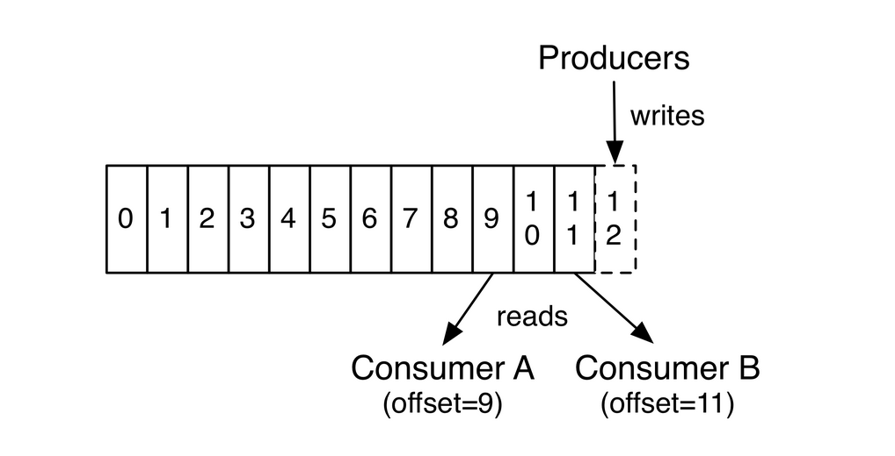

# kafka
## 概念
Kafka有Linkedin公司开发，是一个分布式、支持分区的（partition）、多副本的（replica），基于zookeeper协调的分布式消息中间件，它的最大特性就是可以实时处理大量数据以满足各种需求场景：
比如基于hadoop的批处理系统、低延迟的实时系统、storm/spark流式处理引擎、web/nginx访问日志、消息服务等，用scala语言编写，Linkedin于2010年贡献给Apache基金会，并成为顶级开源项目。

## Kafka使用场景：
* 日志收集：
* 消息系统：
* 用户活动跟踪：
* 运营指标：
 
## Kafka基本概念：
1. Broker： 消息中间件处理节点，一个kafka节点就是一个broker，一个或多个broker可以组成一个kafka集群 
2. Produce： 消息生产者，向Broker发生消息的客户端
3. Consumer： 消息消费者，从Broker读取消息的客户端
   * 消费者消费消息的offset记录机制：消费者自己维护已消费消息的offset, 将offset放在kafka的另一个topic里， topic为__consumer_offsets，key为consumerGroupId+topic+分区号（通过对该key进行hash计算来判断该消息放入到该topic的哪个partition中），value为当前offset值，默认给__consumer_offsets分配50个分区（可以通过offsets.topic.num.partitions参数设置），这样可以增加机器提高并发量
   * 消费者Rebalance机制： 消费者rebalance就是说如果consumer group中的某个消费者挂了，此时会自动把分配给他的分区交给其他的消费者，如果他又重启了，那么又会把一些分区重新交还给他
4. ConsumerGroup： 每一个Consumer属于一个特定的ConsumerGroup，一条消息可以被多个不同的ConsumerGroup消费，但是一个ConsumerGroup中只能有一个Consumer能够消费该消息 
   
5. Topic：kafka根据Topic对消息进行归类，发布到kafka集群的每条消息都要指定一个topic，一个topic代表逻辑上的一个业务数据集；比如订单的消息放入名为order的topic中，用户的消息放入user的topic中，而对于大型网站来说，每一个topic的数据都可能是海量的，因此在topic下划分了多个partition来存储消息数据，不同的partition可以位于不同的机器上
   * 对同一个topic中的消息，同一个消费组里只有一个消费者会消费消息
   * topic是一个逻辑分组，一个topic下可以有多一个partition
6. Partition：物理概念，一个topic可以分为多个partition,每个partition内部消息是有序的, 这些message按顺序添加到一个叫做commitlog的文件中，每个partition中的消息都有一个唯一的编号，叫做offset，用来唯一标识某个分区中的message；每个partition对应一个目录，
   * 一个partition目录中包括：.index（offset索引文件）, .log（存放实际的消息）, .timeindex以及leader-epoch-checkpoint文件。
   * 一个partition只能被一个消费者消费，因此消费者数量大于partition数量时，有消费者会处于空闲状态。
   * 一个broker下的partition不会重复
   * 顺序消息： 需要保证顺序消费的消息必须往同一个partition发送，否则无法保证顺序，即同一分区中的消息会保证顺序消费；
   
7. 每个consumer是基于自己在commitlog中的消费进度（offset）来进行工作的。offset由消费者自己来维护，offset放在__consumer_offset主题中； 一般情况下，consumer按照顺序逐条消费commitlog中的消息，当然也可以指定offset来重复消费或者跳过消息
   
8. kafka集群是无状态的，性能不会因为consumer数量受太多影响。kafka还将很多关键的信息记录在zookeeper里，保证自己是无状态，从而在水平扩容时非常方便。
9. **服务端(broker)与客户端(producer,consumer)之间通信通过tcp协议来完成**
10. **一个topic会被所有consumerGroup消费，每个consumerGroup下只有一个consumer消费**
11. broker会为topic的每个partition生成一个目录，目录位于data.dir配置的路径下，如：`/usr/local/data/kafka-log`
12. Replica: 副本，分区的备份，存在于不同的broker中，副本数不能大于broker的数量，且只有leader副本负责读写消息，其他的副本只复制数据，当leader节点挂掉后，会由新的leader负责读写消息
13. 一个分区只能被一个消费者消费(同一个消费组下)，一个消费者可以消费多个分区(主题)

## 安装及常用操作
```bash
# 下载
$ wget https://archive.apache.org/dist/kafka/1.1.0/kafka_2.11-1.1.0.tgz
# 解压，进入目录
$ tar -zxvf kafka_2.11-1.1.10.tgz; 
$ cd kafka_2.11-1.1.0
#启动
$ bin/kafka-server-start.sh -daemon config/server.properties

# 创建topic
$ bin/kafka-topics.sh --create --zookeeper localhost:2181 --replication-factor 1 --partitions 1 --topic topic1
# --replication-factor: 副本因子，备份的副本数量，该参数不能大于broker的数量，例如集群中有3个broker实例，则最大为3，否则会报错
# --partitions: 分区数，topic中的消息会分布在不同的partition中，提高吞吐量，因为只有leader副本才能读写消息

# 启动生产者
$ bin/kafka-console-producer.sh --broker-list localhost:9092 --topic topic1

# 启动消费者
$ bin/kafka-console-consumer.sh --bootstrap-server localhost:9092 --consumer-property group.id=group1 --topic topic1 --from-begining
# --from-begining 如果topic的创建先于消费者就绪之前，并且生产者向该topic发送了消息，消费者必须指定该参数才能消费到之前的消息，或者指定--offset定位到具体的消息偏移量

# 查看组名
$ bin/kafka-consumer-groups.sh --bootstrap-server localhost:9092 --list

# 查看消费者的消费偏移量
$ bin/kafka-consumer-groups.sh --bootstrap-server localhost:9092 --describe --group group1

GROUP           TOPIC           PARTITION  CURRENT-OFFSET  LOG-END-OFFSET  LAG             CONSUMER-ID                                     HOST            CLIENT-ID
group1          topic6          0          2               2               0               consumer-1-336951c0-fb2b-426b-a505-f8b07233c884 /192.168.1.182  consumer-1
group1          topic1          0          12              12              0               -                                               -               -
group1          topic4          0          4               4               0               -                                               -               -
group1          topic5          0          8               8               0               -                                               -               -
# current-offset 当前消费者偏移量
# log-end-offset 结束的偏移量(HW)
# lag: 落后消费的消息数
# 看topic6的这三个数字分别为2，2，0；实际上topic6就是在消费者就绪之前创建并且产生了2条消息，这时新的消费者连接时，如果不指定--from-beginning或者offset参数，就会从offset 3开始消费
# 默认情况下，一个topic下的消息会固定被一个consumer客户端消费

# 查看topic信息
$ bin/kafka-topics.sh --describe --zookeeper localhost:2181 --topic topic1
Topic:topic1	PartitionCount:1	ReplicationFactor:1	Configs:
	Topic: topic1	Partition: 0	Leader: 0	Replicas: 0	Isr: 0
# Partition: 分区ID
# Leader: 分区的leader副本所在的broker id，负责所有的消息读写
# Replicas: 副本列表，表示某个partition在哪几个broker上存在备份。包括挂掉的broker
# Isr: 是Replicas的一个子集，只列出当前还存活的并且已同步了该partition的broker，

# kafka性能测试脚本
$ bin/kafka-producer-perf-test.sh --topic test --num-records 1000000 -record-size 1024 --throughput -1 --producer-props bootstrap.services=localhost:9092 acks=1

```

## kafka 集群搭建
1. 复制server.properties文件，启动几个实例就复制几次，例如启动三个实例
```bash
$ cp config/server.properties config/server-1.properties
$ cp config/server.properties config/server-2.properties
$ cp config/server.properties config/server-3.properties
```
2. 修改配置文件
* config/server-1.properties:
  ```bash
  broker.id=1
  listeners=PLAINTEXT://192.168.1.182:9092
  log.dir=/usr/local/data/kafka-logs-1
  ```
  
* config/server-2.properties:
  ```bash
  broker.id=2
  listeners=PLAINTEXT://192.168.1.182:9093
  log.dir=/usr/local/data/kafka-logs-2
  ```
  
* config/server-3.properties:
  ```bash
  broker.id=3
  listeners=PLAINTEXT://192.168.1.182:9094
  log.dir=/usr/local/data/kafka-logs-3 
  ```
**集群没有额外的配置，只要所有的kafka实例都注册到同一个zk，则说明他们都是一个集群，kafka强依赖于zk**
  
## kafka配置
### 1.[Broker配置](http://kafka.apache.org/documentation/#brokerconfigs)
1. 必要配置项：
   * broker.id
   * log.dirs
   * zookeeper.connect
   
### 2.[Producer配置](http://kafka.apache.org/documentation/#producerconfigs)
重要配置项：
1. key.serializer: 实现了org.apache.kafka.common.serialization.Serializer接口的序列化类
2. value.serializer: 实现了org.apache.kafka.common.serialization.Serializer接口的序列化类 
3. **acks**:
   * 1：默认值，leader持久化后反馈给producer客户端，当消息还未同步给follower时，leader挂掉就可能会丢消息
   * 0： prodcuer发送后不等待broker确认收到消息的回复，就可以继续发送下一条消息。性能最高，但最容易丢消息。该配置会导致retries失效
   * -1/all: 需要等min.insync.repicas多个节点都持久化后才反馈给producer客户端
4. min.insync.replicas: 当acks设置为all或者-1时，kafka集群需要等到多少个副本都持久化消息后才反馈给producer客户端
5. buffer.memory: producer客户端的消息缓存大小，默认32M

### 3.[Consumer配置](http://kafka.apache.org/documentation/#consumerconfigs)
1. group.id: 消费者的组ID
2. key.deserializer: 反序列化类
3. value.deserializer: 反序列化类
4. heart.interval.ms: consumer与broker的心跳时间间隔
5. session.timeout.ms: 根据该参数判断consumer是否挂掉，如果挂掉则触发消费者rebalance，并剔除挂掉的consumer 
6. enable.auto.commit: consumer客户端自动提交，默认为true， 提交的topic为 __consumer_offsets
7. auto.commit.interval.ms: 自动提交的时间间隔，默认5000毫秒
8. max.poll.interval.ms: 如果两次poll操作间隔超过了这个时间，broker就会认为这个consumer处理能力不足，会将其提出消费组，将分区分配给别的consumer消费

**服务端broker通过心跳确认consumer是否故障，poll 长轮询机制拉去消息；如果拉到了直接返回，如果没有拉倒消息，判断时间是否超过timeout配置时间，没有超过时继续拉去**

[配置项列表](kafka_configure_item.xlsx)

## kafka各种leader及选举机制
### 1.kafka controller 核心总控制器， 即broker的leader, 负责管理整个集群中所有分区和副本的状态。
   * 当分区leader挂掉后，由controller为该分区选举新的leader副本
   * 当检测到某个分区的ISR列表发生变化时，有Controller负责通知所有broker更新其元数据信息
   * 当某个topic分区改变时(如：使用kafka-topics.sh脚本为某个topic增加了分区时)，由Controller负责分区的重新分配(消费者rebalance)
   * Controller选举机制： kafka启动时会向zookeeper中创建/controller临时节点， 写入brokerid, timestamp; 谁创建成功，谁就是leader节点，其他节点都监听这个节点
   * controller 会监听zookeeper中的数据，可以感知分区的leader是否故障
 
### 2.分区副本leader
   * controller 监听/broker/ids(该节点下全是临时节点，挂掉后就会消失，因此可以感知broker是否存活)感知leader是否挂掉，挂掉之后，从replicas里从小到大查找，如果在isr（已同步列表）里，则可以选举为leader
 
### 3.消费者Rebalance机制
#### 3.1 如下情况可能会触发消费者rebalance:
   * consumer所在的服务重启或宕机
   * 动态给topic增加了分区
   * 消费组订阅了更多的topic
 
#### 3.2 Rebalance过程如下：
1. 选择组协调器
   1. 每个消费者发送FindCoordinatorRequest给broker
   2. broker选出组协调器(GroupCoordinator)
      > 1.组协调器GroupCoordinator: 每个消费组都会选择一个broker作为自己的组协调器，负责监控这个消费组里所有消费组的心跳，用于判断消费组是否正常，并决定是否触发rebalance。      
      > 2.Consumer Group中的每个消费者启东时都会向Kafka集群中的某个broker节点发送FindCoordinatorRequest请求来查找对应的组协调器(GroupCoordinator)，并跟其建立网络连接。     
      > 3.组协调器选择方式：通过`hash(consumerGorupId) % __consumer_offsets主题的分区数(默认50个，可通过配置修改)`公式判断consumer消费的offset要提交到_consumer_offsets的哪个分区，这个分区leader对应的broker就是这个消费组的组协调器(Group Coordinator)。
2. 加入消费组(Join Group)
   1. 消费者发送JoinGroupRequest给GroupCoordinator
   2. GroupCoordinator选出LeaderCoordinator(谁先发送请求，谁就是LeaderCoordinator)
   3. LeaderCoordinator制定分区方案
3. 同步(Sync Group)
   1. LeaderCoordinator(就是其中一个消费者)发送SyncGroupRequest给GroupCoordinator(broker)
   2. GroupCoordinator下发分区方案给所有的consumer
4. **注意区分两个概念：`GroupCoordinator`:消费组的协调器，是一个broker节点，`LeaderCoordinator`：某个组下所有消费者的主协调器，是一个consumer**

#### 3.3 消费者Rebalance分区分配策略：
主要有三种rebalance的策略： range(默认), round-robin, sticky；通过消费者的partition.assignment.strategy参数配置。
假设一个主题有10个分区，3个消费者：
1. range：
   * 按分区序号排序，假设n(分区数/消费者数量) = 3, m(分区数%消费者数量) = 1， 那么前m个消费者每个分配n+1个分区，后n-m个消费者每个分配n个分区。
   * 本示例就是：分区0~3给一个消费者，4~6给一个消费者，7~9给一个消费者
2. round-robin：轮询分配，分区0、3、6、9给一个消费者，
3. sticky：
   * 分区的分配尽可能均匀
   * 分区的分配尽可能与上次一致

## Producer发布消息机制
1. 写入方式：producer采用push模式将消息发布到broker, 每条消息都被append到partition中，属于顺序写磁盘（顺序写磁盘效率比随机写内存要高，保证kafka吞吐率）。
2. 消息路由：producer发送消息到broker时，会根据分区算法选择将其存储到哪一个partition，其路由机制为：
   1. 指定了partition, 则直接些人；
   2. 为指定partition, 但指定key, 通过对key进行hash选出一个partition.
   3. 都未指定，使用轮询选出一个partition
3. 写入流程：
   1. producer先从zookeeper的"/brokers/.../state"节点找到该partition的leader
   2. producer将消息发送给该leader
   3. leader将消息写入本地log
   4. followers从leader pull 消息，写入本地log后，向leader发送ACK消息
   5. leader收到所有ISR的ACK后，增加HW(high watermark, 最后commit的offset)，并向producer发送ACK

## HW与LEO
1. HW: HighWatermark, 消费者能消费到的消息位移
2. LEO: Log-End-Offset, broker接收到消息后，写入日志的最高偏移量, LEO >= HW, 因为leader需要等所有follower pull消息并发送ACK给leader(ACKS = all/-1模式下)

## [Kafka集群管理界面](https://www.cnblogs.com/dadonggg/p/8205302.html)

## Kafka zookeeper 节点

   
## 问题：
* 消息乱序： 当消息重试时是可能导致消息乱序，因此要根据自己的业务情况谨慎选择是否重试。
* 消息积压： 
  1. 增加分区，并增加消费者（消费者数量需要小于分区数，否则会有消费者闲置，因为一个分区只能被一个消费者消费）
  2. 将消息转到其他主题（设置很多分区）中（类似**死信队列**），然后在慢慢分析处理问题。
* 消息丢失问题： 
  1. producer端： acks设置为all/-1，并且将min.insync.replicas设置为2及以上
  2. consumer端： 可能出现在自动提交时，消费的消息还没有处理完，但是已经自动提交了，这时消费者挂掉了，这就导致了消息丢失
* 重复消费问题： 
  1. producer端：已发送消息，由于网络抖动等原因，没有收到broker的ACK，producer会重新发送消息
  2. consumer端：已消费消息，但是还没有提交，consumer挂了，这条消息会被重复消费
  3. **消费端幂等性设计** 
* 延时队列： 延时队列存储的是延时消息。所谓"延时消息"是指消息被发送以后，并不想让消费者立刻消费，而是等待特定时间后，消费者才能获取和消息进行消费，使用场景如下：
  1. 用户下单后通常有30分钟的时间进行支付，如果30分钟之内没有支付成功，那么这个订单将进行异常处理，这时就可以用延时队列来处理这些订单消息
  2. 订单完成1小时后通知用户评价
  3. **实现思路：** 创建各个时间间隔的队列，例如：order_5s, order_10s, order_10m, order_30m; 然后用定时任务轮询这些队列，判断消息进入队列的时间(消息头中有)与当前时间比较，是否超过(5s, 10s, 10m)这些时间，当超过后，把这些消息重新发送到真正的业务队列中

  
  