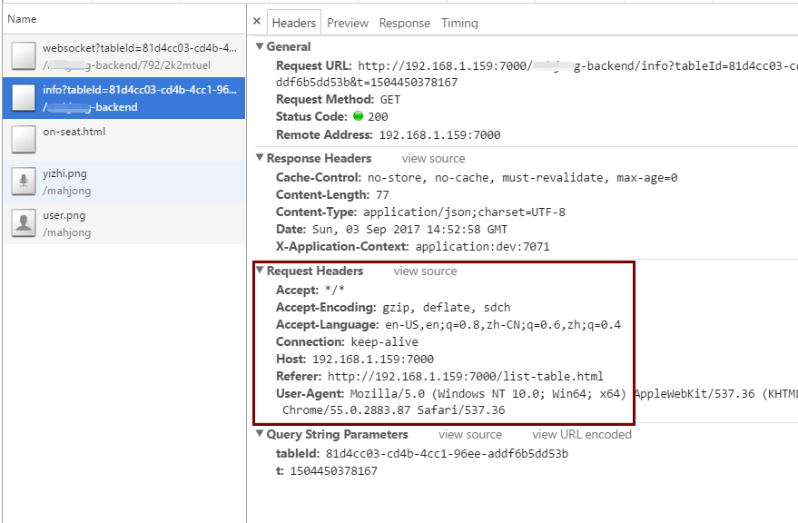
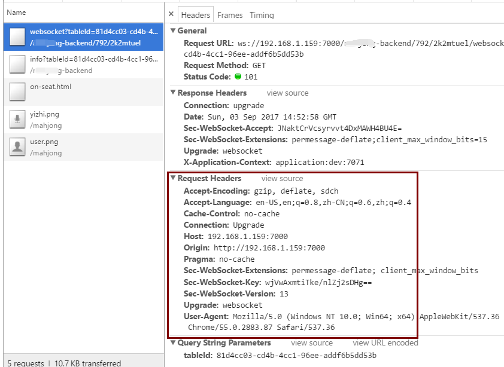

# [王孝东的个人空间](https://scm-git.github.io/)
## WebSocket STOMP SockJS
### WebSocket
* Stack Overflow上的说明：Nginx与Apache作为WebSocket的load balancer并不能很好支持，如果自己取配置Nginx或者Apache将是一件非常痛苦的事，而HAProxy可以很好的支持。另外我自己测试过使用nginx作为反向代理服务器，没有配置成功
* [Stack Overflow对WebSocket+Load Balancer的说明](https://stackoverflow.com/questions/15817784/what-are-issues-with-using-websockets-with-proxies-and-load-balancers)
* [HAProxy + WebSocket配置方式](http://blog.silverbucket.net/post/31927044856/3-ways-to-configure-haproxy-for-websockets)
* [HAProxy + WebSocket配置方式](https://www.haproxy.com/blog/websockets-load-balancing-with-haproxy/)

### STOMP
好的文章：
* [STOMP](http://stomp.github.io/implementations.html)
* [STOMP Over WebSocket](http://jmesnil.net/stomp-websocket/doc/websocket2.md)

### SockJS
* [GitHub上关于-SockJS-node+Load Balancer的说明](https://github.com/sockjs/sockjs-node#websocket-compatible-load-balancer)

### 使用RabbitMQ作为broker的WebSocket实现
* [GitHub地址](https://github.com/itzg/websocket-stomp-user-queues)

### 非常好的文章：[How HTML5 Web Sockets Interact With Proxy Servers](https://www.infoq.com/articles/Web-Sockets-Proxy-Servers)

### STOMP WebSocket无法设置自定义header问题：
由于STOMP WebSocket无法设置自定义的header，因此如果在负载均衡器(如HA)中想要根据某个值做后端路由是不可行的，可以将参数放到url中来实现，下面通过几个截图来查看websocket设置自定义header问题：

我的前端代码中有如下设置header的部分：
```javascript
var socket = new SockJS('/xxxx-backend?tableId=' + tableId);
stompClient = Stomp.over(socket);

// 指定座位的direction: TODO
stompClient.connect({roomId:roomId,tableId:tableId,userId:userId}, function (frame) {
    console.log('Connected: ' + frame);
    subscribeTable(tableId,userId);
});
```
然而，从浏览器中却无法看到这几个header参数：不管是websocket的info端点还是upgrade的websocket都没有：



