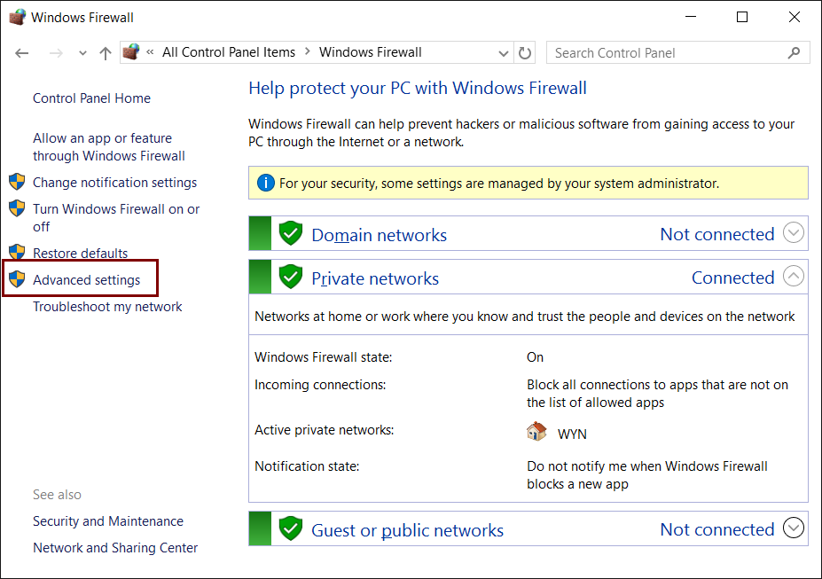
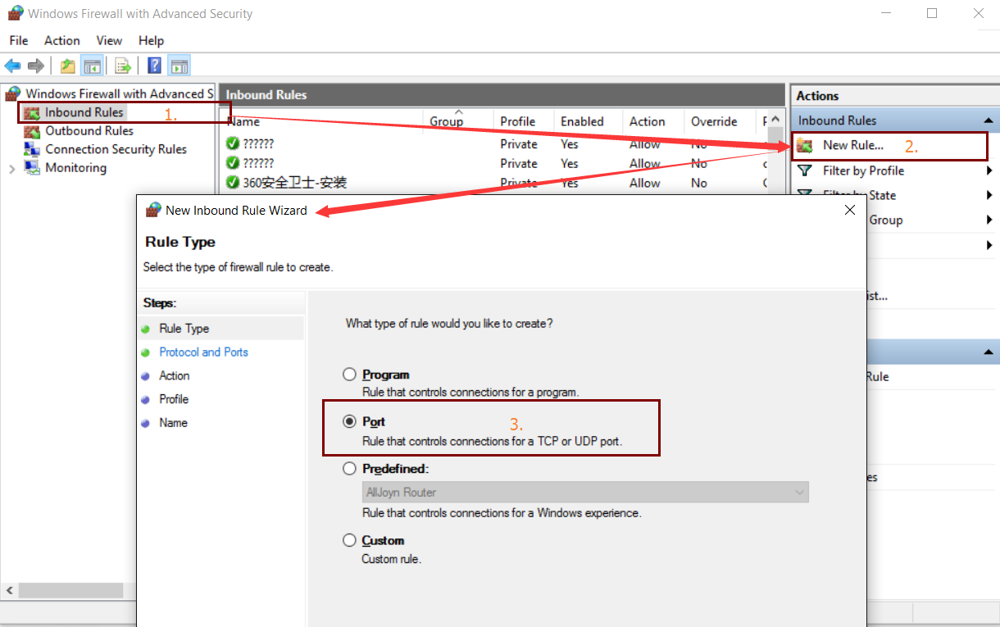
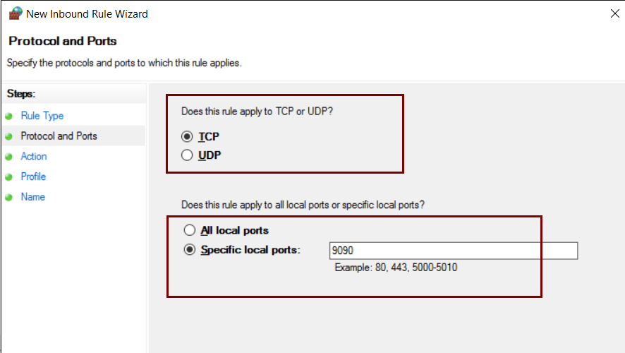

# [王孝东的个人空间](https://scm-git.github.io/)
## Windows 10
### 开启telnet
```
C:\WINDOWS\system32>dism /online /Enable-Feature /FeatureName:TelnetClient

Deployment Image Servicing and Management tool
Version: 10.0.10586.0

Image Version: 10.0.10586.0

Enabling feature(s)
[==========================100.0%==========================]
The operation completed successfully.

C:\WINDOWS\system32>
```
执行该命令的时候需要以管理员身份，否则会740 error：

进入到C:\WINDOWS\system32， 鼠标右键点击cmd.exe，选择以管理员身份运行即可

### 打开端口
如果windows 10系统上的的tomcat端口在本机能够正常访问，而不能从其他机器访问的话，通常是防火墙限制了端口的访问，可以按照如下方式打开端口:
* 打开控制面板-->防火墙-->高级设置-->入站规则-->新建规则-->端口-->下一步-->填入要打开的端口(如：8080)-->按要求填写相关属性-->完成，之后就可以访问已打开的端口了。截图如下：
  
  
  

